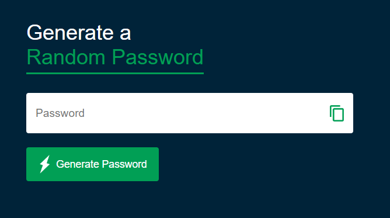
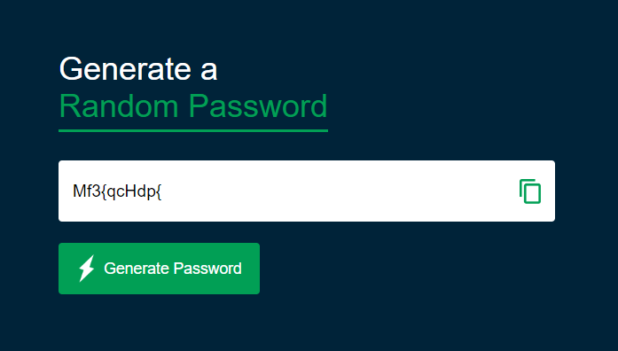

<h1 align="center"> Simple Quiz App </h1>

 Projeto 4 da Playlist "30 Days, 30 JavaScript Projects For Beginners to Practice" do YouTube

<a href="https://youtube.com/playlist?list=PLjwm_8O3suyOgDS_Z8AWbbq3zpCmR-WE9&si=fGAY36wF61wGKd3x">🔗Clique aqui para acessar a playlist</a>

 

  

  

## 🚀Tecnologias

Esse projeto foi desenvolvido com as seguintes tecnologias:

-> HTML e CSS
 
-> JavaScript
 
-> Git e Github

## 💻Projeto

- [Visite o projeto online](https://mariaeduardateixeira.github.io/generate-random-password/)

